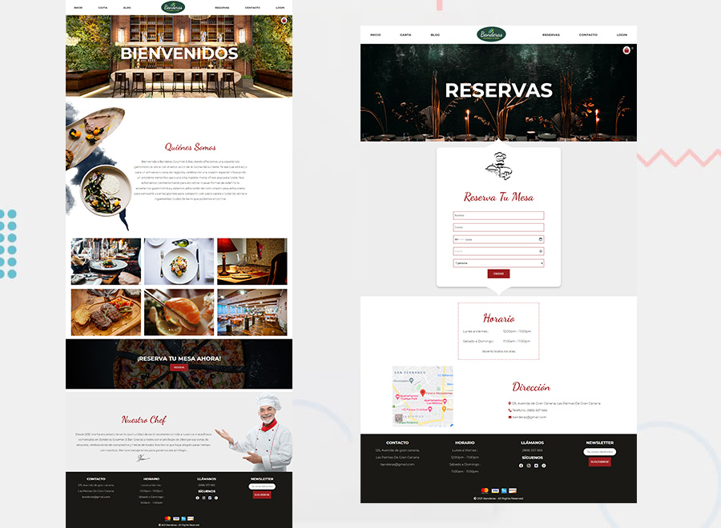

# Restaurant Fullstack website and e-commerce

### Tools

- [React.js](https://reactjs.org/)
- [AOS](https://michalsnik.github.io/aos/)
- [Axios](https://www.axios.com/)
- [Cogo-toast](https://cogoport.github.io/cogo-toast/)
- [Sweetalert](https://sweetalert2.github.io/)
- [Hamburger-react](https://hamburger-react.netlify.app/)
- [react-credit-cards](https://github.com/amaroteam/react-credit-cards#readme)
- [react-hook-form](https://react-hook-form.com/)

### Development

The coding of the layout put my layout skills to the test, especially when laying out the background patterns for different screen sizes. I used a combination of CSS flexbox and grid for the responsive layout of the main content sections of the page. A user can log in and track their orders. Validations are done through react hook form and notifications via cogo toast and sweetalert.
